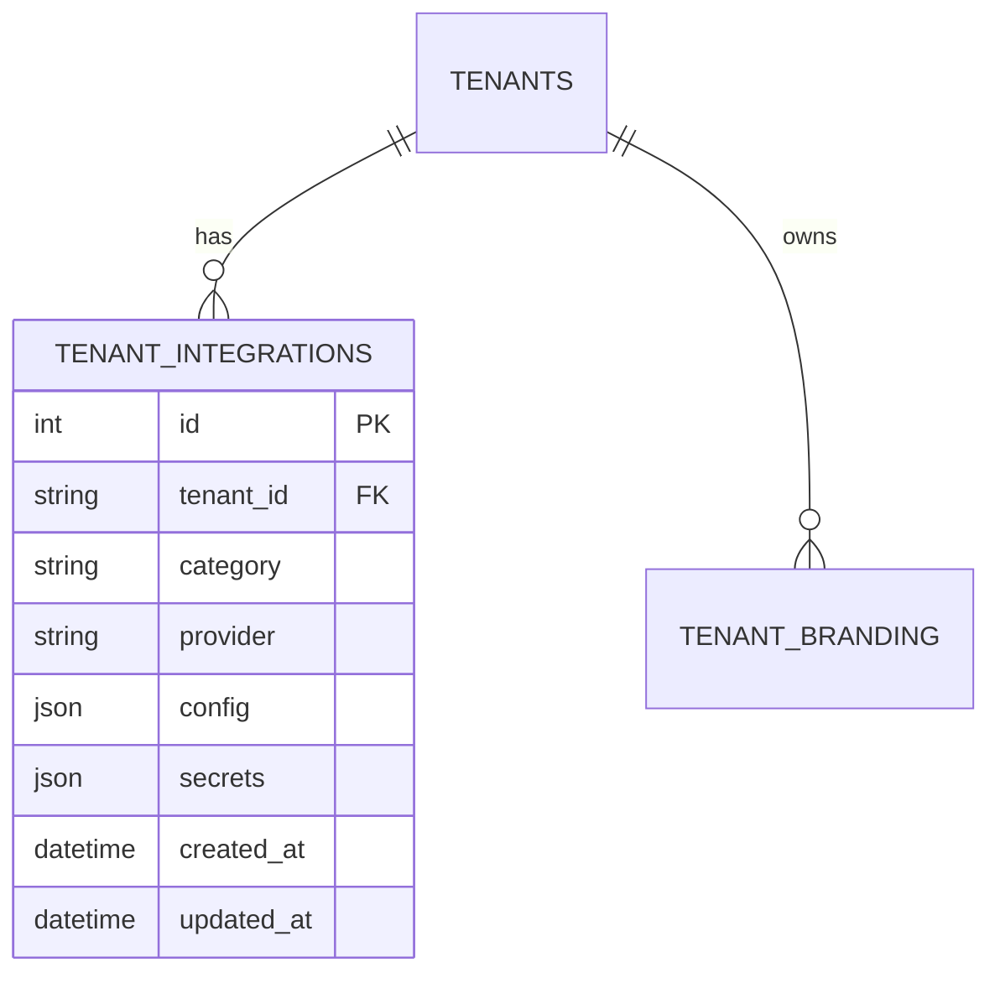

# Tenant Configuration Inventory & Schema

This document captures the current state of tenant-scoped configuration, the target normalized schema, and migration notes for the phased rollout.

## High-Level Goals

- Centralize tenant-specific settings behind `TenantSettingsService`.
- Store secrets in `tenant_integrations` with references to Azure Key Vault.
- Keep non-secret metadata in structured JSON for fast reads.
- Maintain backward compatibility during the rollout by falling back to legacy `Tenant.config` until migration is complete.

## Configuration Inventory

| Subsystem | Legacy Location | Target Location | Secret? | Notes |
|-----------|-----------------|-----------------|---------|-------|
| Email (SendGrid) | `Tenant.config['email']` | `tenant_integrations` (category=`email`, provider=`sendgrid`) | ✅ API key | Non-secret fields (`from_email`, `from_name`) remain in integration `config`. Secret stored by reference. |
| Support contacts | `TenantBranding.support_email` / `Tenant.config['support']` | `TenantBranding` (unchanged) | ❌ | Exposed through tenant settings for convenience. |
| Payment (Yoco) | `Tenant.config['payments']` | `tenant_integrations` (category=`payments`, provider=`yoco`) | ✅ Secret + webhook | Webhook secret + API key stored via Key Vault reference. Non-secret like provider name in config. |
| Auth overrides | `Tenant.config['auth']` | `Tenant.config['auth']` (short-term) | ✅ reset secret | Future work to move into integrations once rate limiting phase stabilizes. |
| Rate limits | `Tenant.config['rate_limits']` | `Tenant.config['rate_limits']` (structured JSON) | ❌ | Already consumed through `TenantSettingsService.get_rate_limit`. |
| Subscription settings | `Tenant.config['subscription']` | `Tenant.config['subscription']` + future integrations | ⚠️ mixed | Secret data (future Yoco tokens) migrate to integrations; plan documented below. |

## Target Schema (Mermaid ERD)

- `category` namespaces integrations (`email`, `payments`, `auth`, etc.).
- `provider` distinguishes concrete vendors (`sendgrid`, `yoco`).
- `config` stores non-secret metadata (e.g., `from_email`, `mode`, feature flags).
- `secrets` is a keyed JSON object (e.g., `{ "api_key": { "vault_name": ..., "version": ..., "fallback": ... } }`). Fallback values are only present during migration; rotation jobs move the data to Key Vault and drop the fallback entry.

## Migration Strategy

1. **Backfill:** Copy existing email/payment config from `Tenant.config` into `tenant_integrations`, generating deterministic secret names and preserving the legacy value in `secret_value`.
2. **Runtime:** `TenantSettingsService` first checks `tenant_integrations`; if empty it falls back to JSON config.
3. **Key Vault wiring:** At runtime we attempt to resolve secrets via Azure Key Vault using each entry in `secrets` (`vault_name` + optional `version`) with a safe fallback to `fallback` when present.
4. **Cleanup:** Once Key Vault rotation jobs run, `fallback` values will be removed and `Tenant.config` secrets pruned.

## Open Items

- Auth reset secrets still read directly from `settings`; plan to migrate after email/payment stabilization.
- Add admin UI affordances to list integrations and generate rotation events.
- Enforce lint rule (or CI check) to block direct `settings.*` usage in tenant-aware routes; tracked in rollout checklist.

